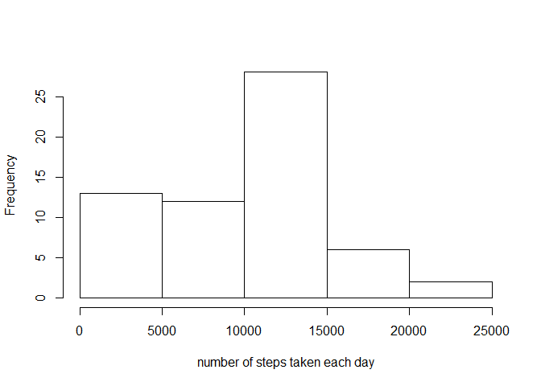
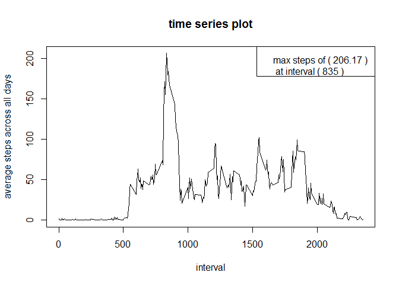
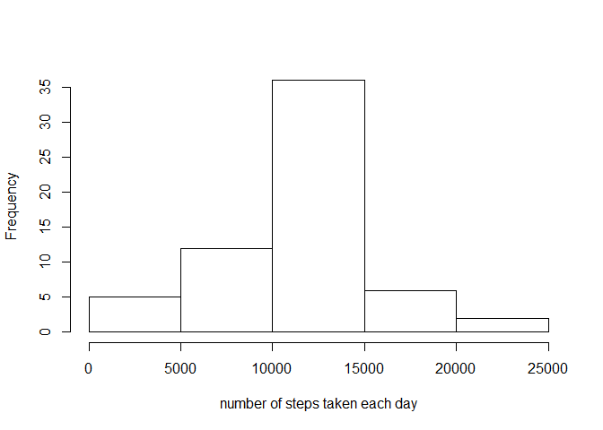
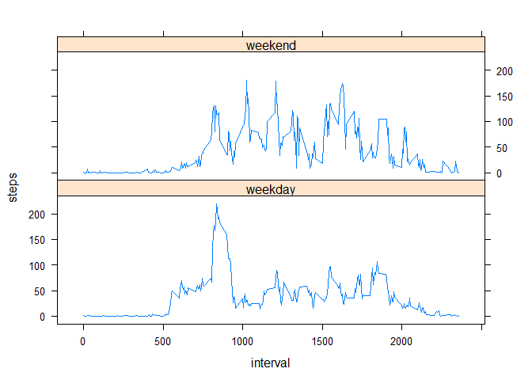

# Reproducible Research: Peer Assessment 1


## Loading and preprocessing the data


```r
activity_data <- read.csv("activity.csv", header=TRUE)
# summary(activity_data)
```


## What is mean total number of steps taken per day?


```r
# Computing the number of steps taken per day (total of 61 days)
# Have included the plyr package
# Ignoring the NA values in the data set indicated in the question

daily_steps <- ddply(activity_data, .(date), summarize, 
                     steps=sum(steps, na.rm=TRUE))

# Histogram of the total number of steps taken each day
# hist(daily_steps$steps, xlab = "number of steps taken each day", main="")

# Calculating the mean and median of total number of steps taken per day

steps_mean <- mean(daily_steps$steps)
steps_median <- median(daily_steps$steps)
```

1. Make a histogram of the total number of steps taken each day
 

2. Calculate and report the mean and median total number of steps taken per day
  - Mean of total number of steps taken per day = 9354.2295082
  - Median of total number of steps taken per day = 10395


## What is the average daily activity pattern?

1. Make a time series plot (i.e. type = "l") of the 5-minute interval (x-axis) and the average number of steps taken, averaged across all days (y-axis)


```r
# Computing the average number of steps taken, averaged across all days
# Ignoring the NA values in the data set indicated in the question

interval_steps <- ddply(activity_data, .(interval), summarize, 
                     steps=mean(steps, na.rm=TRUE))

max_steps <- max(interval_steps$steps)
interval_at_max_steps <- interval_steps[interval_steps$steps == max_steps, 1]

plot(interval_steps$interval, interval_steps$steps, type="l", 
     xlab="interval", ylab="average steps across all days",
     main="time series plot")

legend(x="topright", paste("max steps of (", 
                           as.character(round(max_steps, 2)),
                           ")\n at interval (",
                           as.character(interval_at_max_steps), ")"))
```

 

2. Which 5-minute interval, on average across all the days in the dataset, contains the maximum number of steps?

    \(835\) 5-minute interval contains the maximum number of steps.

## Imputing missing values

Note that there are a number of days/intervals where there are missing values (coded as NA). The presence of missing days may introduce bias into some calculations or summaries of the data.

1. Calculate and report the total number of missing values in the dataset (i.e. the total number of rows with NAs)


```r
activity_data <- mutate(activity_data, 
                        is_na = is.na(steps))
num_na <- sum(activity_data$is_na)
```
    The total number of missing values in the dataset is 2304
 
2. Devise a strategy for filling in all of the missing values in the dataset.

  We are using the mean of 5-minute interval to fill the missing value


3. Create a new dataset that is equal to the original dataset but with the missing data filled in.


```r
imputed_data <- activity_data

# using the mean of that 5-minute interval to fill the missing value
# interval_steps has the average of steps for all days for the given interval
for (i in 1:dim(imputed_data)[1]) {
   if (is.na(imputed_data$steps[i])) {
    imputed_data$steps[i] <- interval_steps[interval_steps$interval == 
                                              imputed_data$interval[i],2]
  } 
}
```


4. Make a histogram of the total number of steps taken each day and Calculate and report the mean and median total number of steps taken per day. Do these values differ from the estimates from the first part of the assignment? What is the impact of imputing missing data on the estimates of the total daily number of steps?


```r
# Computing the number of steps taken per day (total of 61 days)
# Have included the plyr package
# Ignoring the NA values in the data set indicated in the question

imputed_daily_steps <- ddply(imputed_data, .(date), summarize, 
                     steps=sum(steps))

# Histogram of the total number of steps taken each day
# hist(daily_steps$steps, xlab = "number of steps taken each day", main="")

# Calculating the mean and median of total number of steps taken per day

imp_mean <- round(mean(imputed_daily_steps$steps),2)
imp_median <- round(median(imputed_daily_steps$steps),2)

# Dont display number in scientific format
options(scipen = 1, digits = 2)
```

a) Make a histogram of the total number of steps taken each day


 

b) Calculate and report the mean and median total number of steps taken per day

- Mean of total number of steps taken per day = 10766.19

- Median of total number of steps taken per day = 10766.19


c) Do these values differ from the estimates from the first part of the assignment? What is the impact of imputing missing data on the estimates of the total daily number of steps?

  - Imputed mean = 10766.19 non imputed mean = 9354.23
  
  - Imputed median = 10766.19 non imputed median = 10395
  


The number of steps taken each day mean of imputed data has increased

The number of steps taken each day median of imputed data has increased

## Are there differences in activity patterns between weekdays and weekends?

1. Create a new factor variable in the dataset with two levels - "weekday" and "weekend" indicating whether a given date is a weekday or weekend day.


```r
imputed_data <- mutate(imputed_data, 
                       weekend = ifelse(weekdays(as.Date(date)) == "Sunday",
                                        "weekend", "weekday"), 

                       new_steps = (mean(steps) - steps))
```

2. Make a panel plot containing a time series plot (i.e. type = "l") of the 5-minute interval (x-axis) and the average number of steps taken, averaged across all weekday days or weekend days (y-axis). 


```r
# Computing the average steps taken across all week day or weekend
imputed_weekday_steps <- ddply(imputed_data, .(weekend, interval),
                               summarize, steps=mean(steps))

xyplot(steps~interval|weekend, data=imputed_weekday_steps, type="l", 
       layout=c(1,2))
```

 

